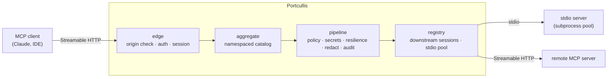

# Portcullis

[](https://github.com/JumpTechCode/portcullis/actions/workflows/ci.yml)
[](https://github.com/JumpTechCode/portcullis/actions/workflows/codeql.yml)

Portcullis is a security gateway for the [Model Context Protocol](https://modelcontextprotocol.io)
(MCP). It presents itself to clients as a single MCP server and proxies their
tool calls to the downstream MCP servers they are allowed to use. Clients
authenticate to the gateway and never hold downstream credentials; every call
passes through a deny-by-default policy, gateway-held secret injection, and
outbound redaction before it reaches a downstream or the audit log.

## Status

The V1 feature set is implemented: client authentication, deny-by-default
policy, downstream proxying over stdio and HTTP, connection-level secret
injection, outbound redaction, circuit breaking and timeouts, structured audit,
Prometheus metrics, and configuration hot-reload. The repository builds and is
tested under CI. It is young software — interfaces may still change, and it has
not yet seen production use. See [Scope](#scope) for the precise boundaries of
what V1 does and does not cover.

## Why a gateway

Connecting an MCP client directly to many servers means distributing
credentials to each client and trusting every client to call only what it
should. Portcullis centralises that trust:

- **Clients never hold downstream secrets.** The gateway resolves each
  downstream credential from an environment variable and applies it at the
  connection — as an environment variable in the stdio subprocess, or as a
  request header to a remote server. The client authenticates only to the
  gateway and never sees the credential. (Connection-level injection is a
  deliberate V1 scope; see [ADR-0012](docs/adr/0012-connection-level-secret-injection-for-v1.md).)
- **Deny by default.** A client can call a tool only when an explicit rule
  allows it. Tools a client may not call are hidden from its catalog entirely —
  including their schemas and descriptions.
- **Edge hardening.** The client-facing endpoint validates the request `Origin`
  to guard against DNS rebinding, is configured to bind to localhost, and
  authenticates API keys with a constant-time comparison.
- **Redaction.** Injected secret values are scrubbed from results, errors, and
  notifications before they leave the gateway or are written to the audit log.
- **Audit.** Every call produces a structured, post-redaction record.

## Architecture



Each client session gets its own sessions to the downstreams it is allowed to
use, so notifications, cancellation, and per-session state never cross between
clients (see [ADR-0002](docs/adr/0002-per-client-session-downstream-sessions.md)).
The internal packages form an acyclic dependency graph: shared types and port
interfaces live in `internal/domain`, concrete packages depend on `domain` but
never on each other, and only the composition root (`internal/app`) wires
concrete implementations together. The graph is enforced mechanically (see
[Development and checks](#development-and-checks)).

## Security model

Portcullis is deny-by-default and treats catalog visibility as
security-load-bearing.

- **Deny-by-default policy.** A call is allowed only when an explicit rule
  permits it. Conflicts resolve most-restrictively. A wildcard rule
  (`github__*`) admits only the tools observed at the last allowlist sync, so a
  downstream cannot widen a client's access by exposing a new tool later
  ([ADR-0009](docs/adr/0009-wildcard-policy-rules-pin-to-synced-tool-set.md)).
- **Hidden catalog entries.** A client never receives the schema or description
  of a tool it may not call; disallowed tools are filtered out of `tools/list`.
- **Origin / DNS-rebinding guard.** Every request's `Origin` is checked against
  an allowlist before authentication. An absent `Origin` (non-browser clients)
  is permitted; the configured localhost bind is the primary defense against the
  browser-only rebinding vector.
- **Constant-time API-key authentication.** Presented keys are compared in
  constant time over fixed-width SHA-256 digests, so the comparison time does
  not vary with the key's length or content
  ([ADR-0003](docs/adr/0003-static-api-key-client-authentication.md)).
- **Connection-level secret injection.** Gateway-held credentials are applied at
  the transport (stdio environment or HTTP header), never exposed to clients,
  and registered with the outbound redactor by value.
- **Outbound redaction.** Injected secret values are removed by exact match.
  Configurable PII patterns add literal-gated regular expressions on top. Pattern
  matching is best-effort: it operates on the literal bytes of a payload and does
  not decode base64, percent-encoding, or other transforms, so a value present
  only in an encoded form is not matched. Each result is buffered and scanned in
  full before it is emitted, bounded by a configurable size cap
  ([ADR-0011](docs/adr/0011-buffer-and-scan-redaction.md)).
- **Structured audit.** Every call produces a JSON record after redaction, so
  secret values never reach the audit log. Security records (denials, redactions)
  take a durability path that fails the request closed rather than proceed
  un-audited ([ADR-0010](docs/adr/0010-async-audit-overflow-and-durability.md)).

## Getting started

Requires [Go](https://go.dev/dl/) 1.26 or newer.

```sh
# Build and run the full set of checks that gate every change.
make verify

# Or individually:
make build      # compile all packages
make vet        # go vet
make fmt-check  # fail if any file is not gofmt -s clean
make test       # unit tests
make race       # unit tests with the race detector
make cover      # tests + coverage threshold
make lint       # golangci-lint
make vuln       # govulncheck
```

To run the gateway, copy the example configuration, export the referenced
environment variables, and point the binary at the file:

```sh
cp config/portcullis.example.yaml config/portcullis.yaml
# edit config/portcullis.yaml and export the referenced *_KEY / *_TOKEN env vars
go run ./cmd/portcullis --config config/portcullis.yaml
```

Flags:

- `--config` — path to the configuration file (default `portcullis.yaml`).
- `--version` — print the gateway version and exit.
- `--watch` — reload automatically when the config file changes.
- `--watch-interval` — how often to poll the file under `--watch` (default `1s`).

The gateway hot-reloads its client-auth and policy configuration without
dropping connections. Send `SIGHUP` to reload on demand, or start with `--watch`
to reload automatically:

```sh
go run ./cmd/portcullis --config config/portcullis.yaml --watch
```

Both signals feed a single serialized reload consumer, so reloads never overlap,
and a reload that fails to load or validate leaves the running configuration in
place. Downstream topology, redaction, and audit changes are restart-required;
when a reload detects one it applies the client and policy parts and logs that a
restart is needed for the rest.

## Configuration

Configuration is a single declarative YAML file, validated at startup with
fail-fast errors: a malformed file, an unknown field, a missing referenced
secret, or a rule naming an unknown downstream or client is an error before the
gateway serves. Secrets are referenced by environment-variable name and never
stored in the file. See [`config/portcullis.example.yaml`](config/portcullis.example.yaml)
for a fully commented example.

## Observability

A Prometheus endpoint is served at `/metrics` on the configured listen address.
The registered metrics are:

- `portcullis_calls_total` — tool calls, labelled by client, downstream, and
  policy decision.
- `portcullis_call_latency_seconds` — downstream call latency, by downstream.
- `portcullis_downstream_up` — downstream health, by downstream.
- `portcullis_breaker_state` — circuit-breaker state by downstream (0 closed,
  1 half-open, 2 open).
- `portcullis_pool_in_use` — stdio subprocesses currently checked out, by
  downstream.
- `portcullis_pool_exhausted_total` — stdio pool exhaustion fast-fails, by
  downstream.
- `portcullis_audit_unrecordable_total` — security records that could not be
  audited (the gateway fails closed when this happens, so a rising value is
  security-relevant).

## Project layout

```
cmd/portcullis        command entrypoint, signal handling, reload wiring
internal/domain       shared value types and port interfaces (leaf package)
internal/edge         client-facing Streamable HTTP endpoint, origin/auth guard
internal/aggregate    namespaced, paginated tool catalog and call routing
internal/registry     downstream sessions and the bounded stdio subprocess pool
internal/pipeline     per-call security chain composition
internal/policy       deny-by-default authorisation and catalog filtering
internal/secrets      connection-level secret-injection contract (ADR-0012)
internal/redact       outbound secret and PII redaction
internal/resilience   failure-class-aware circuit breaking and timeouts
internal/audit        asynchronous structured audit pipeline
internal/metrics      Prometheus instrumentation
internal/config       configuration loading, defaulting, and validation
internal/watch        config file-change polling for --watch
internal/guard        import-DAG enforcement test
internal/app          composition root
docs/adr              architecture decision records
```

## Design decisions

The significant, hard-to-reverse choices are recorded as
[architecture decision records](docs/adr) in Michael Nygard's format. Among
them: per-client-session downstream sessions
([ADR-0002](docs/adr/0002-per-client-session-downstream-sessions.md)),
failure-class-aware circuit breaking
([ADR-0005](docs/adr/0005-failure-class-aware-circuit-breaking.md)),
wildcard rules pinned to the synced tool set
([ADR-0009](docs/adr/0009-wildcard-policy-rules-pin-to-synced-tool-set.md)),
the async audit pipeline's overflow and durability behaviour
([ADR-0010](docs/adr/0010-async-audit-overflow-and-durability.md)), and
connection-level secret injection
([ADR-0012](docs/adr/0012-connection-level-secret-injection-for-v1.md)).

## Development and checks

`make verify` runs the same gates CI enforces:

- `go build`, `go vet`, and a `gofmt -s` cleanliness check.
- Unit tests under the race detector, with a coverage threshold of at least 80%
  across `internal/...`.
- `golangci-lint`, including a depguard rule that restricts internal imports to
  the allowed edges of the dependency graph.
- An AST-based import-guard test (`internal/guard`) that parses the source tree
  and fails the build on a forbidden internal import.
- `govulncheck` for known vulnerabilities.

CI additionally runs [CodeQL](.github/workflows/codeql.yml) static analysis. The
toolchain is Go 1.26 and golangci-lint v2.12.2.

## Scope

In scope for V1 (implemented):

- Proxying `tools/list` and `tools/call` across downstream MCP servers over
  stdio and Streamable HTTP.
- Per-client-session downstream sessions and a bounded, supervised stdio
  subprocess pool with idle reaping and fail-fast exhaustion.
- Deny-by-default policy with security-load-bearing catalog filtering.
- Connection-level secret injection (stdio environment or HTTP header).
- Outbound redaction of injected secret values and configurable PII patterns.
- Failure-class-aware circuit breaking and per-call timeouts.
- Asynchronous structured audit with tiered overflow and a fail-closed path for
  security records.
- A Prometheus `/metrics` endpoint.
- `SIGHUP` and `--watch` hot-reload of client-auth and policy configuration.

Not in scope yet — deliberate, documented boundaries:

- Argument-level secret injection and client-schema stripping
  ([ADR-0012](docs/adr/0012-connection-level-secret-injection-for-v1.md)).
- True streaming-window redaction; results are buffered and scanned in full
  ([ADR-0011](docs/adr/0011-buffer-and-scan-redaction.md)).
- MCP `resources` and `prompts` capabilities; only the tools capability is
  served.
- OAuth-based client authentication; V1 uses static API keys
  ([ADR-0003](docs/adr/0003-static-api-key-client-authentication.md)).
- Per-tenant container or process isolation of downstreams.

## Contributing

See [CONTRIBUTING.md](CONTRIBUTING.md) for the development workflow and the
checks every pull request must pass. Security issues should be reported
privately as described in [SECURITY.md](SECURITY.md).

## License

Licensed under the [Apache License 2.0](LICENSE).
