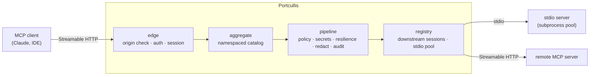

# Portcullis

Portcullis is a security gateway for the [Model Context Protocol](https://modelcontextprotocol.io)
(MCP). It presents itself to clients as a single MCP server and proxies their
tool calls to the downstream MCP servers they are allowed to use. Clients
authenticate to the gateway and never hold downstream credentials; every call
passes through a deny-by-default policy, secret injection, and redaction before
it reaches a downstream or the audit log.

> **Status:** early development. The architecture and interfaces are settled and
> the repository is built and tested under CI, but the gateway is not yet
> feature-complete. See [Roadmap](#roadmap).

## Why a gateway

Connecting an MCP client directly to many servers means distributing
credentials to each client and trusting every client to call only what it
should. Portcullis centralises that trust:

- **Clients never hold downstream secrets.** The gateway holds them and injects
  them per call, into the subprocess environment, an HTTP header, or a declared
  tool argument that is then stripped from the client-facing schema.
- **Deny by default.** A client can call a tool only when an explicit rule
  allows it. Tools a client may not call are hidden from its catalog entirely —
  including their schemas and descriptions.
- **Edge hardening.** The client-facing endpoint validates the request `Origin`
  to guard against DNS rebinding, binds to localhost by default, and
  authenticates API keys with a constant-time comparison.
- **Redaction.** Injected secret values are scrubbed from results, errors, and
  notifications before they leave the gateway or are written to the audit log.
- **Audit.** Every call produces a structured, post-redaction record.

## Architecture



Each client session gets its own sessions to the downstreams it is allowed to
use, so notifications, cancellation, and per-session state never cross between
clients. The internal packages form an acyclic dependency graph: shared types
and interfaces live in `internal/domain`, and only the composition root
(`internal/app`) wires concrete implementations together.

## Getting started

Requires [Go](https://go.dev/dl/) 1.26 or newer.

```sh
# Build and run the full set of checks that gate every change.
make verify

# Or individually:
make build      # compile
make test       # unit tests
make race       # unit tests with the race detector
make cover      # tests + coverage threshold
make lint       # golangci-lint
make vuln       # govulncheck
```

To run the gateway, copy the example configuration and point the binary at it:

```sh
cp config/portcullis.example.yaml config/portcullis.yaml
# edit config/portcullis.yaml and export the referenced *_KEY / *_TOKEN env vars
go run ./cmd/portcullis --config config/portcullis.yaml
```

The gateway hot-reloads its client-auth and policy configuration without
dropping connections. Send `SIGHUP` to reload on demand, or start with `--watch`
to reload automatically when the config file changes:

```sh
go run ./cmd/portcullis --config config/portcullis.yaml --watch
```

`--watch-interval` (default `1s`) sets how often the file is polled. Downstream,
redaction, and audit changes require a restart and are logged when a reload
detects them.

## Configuration

Configuration is a single declarative YAML file, validated at startup with
fail-fast errors. Secrets are referenced by environment-variable name and never
stored in the file. See [`config/portcullis.example.yaml`](config/portcullis.example.yaml)
for a fully commented example.

## Project layout

```
cmd/portcullis        command entrypoint
internal/domain       shared types and port interfaces (leaf package)
internal/edge         client-facing Streamable HTTP server
internal/registry     downstream sessions and the stdio subprocess pool
internal/aggregate    namespaced, paginated tool catalog
internal/pipeline     per-call security chain
internal/policy       deny-by-default authorisation
internal/secrets      credential injection
internal/redact       outbound secret and PII redaction
internal/resilience   circuit breaking and timeouts
internal/audit        asynchronous structured audit log
internal/metrics      Prometheus instrumentation
internal/config       configuration loading and validation
internal/app          composition root
docs/adr              architecture decision records
```

## Roadmap

The gateway is being built one capability at a time, starting from the shared
domain types and the per-call pipeline. Architecture decisions are recorded in
[`docs/adr`](docs/adr) as they are made.

## Contributing

See [CONTRIBUTING.md](CONTRIBUTING.md) for the development workflow and the
checks every pull request must pass. Security issues should be reported
privately as described in [SECURITY.md](SECURITY.md).

## License

Licensed under the [Apache License 2.0](LICENSE).
